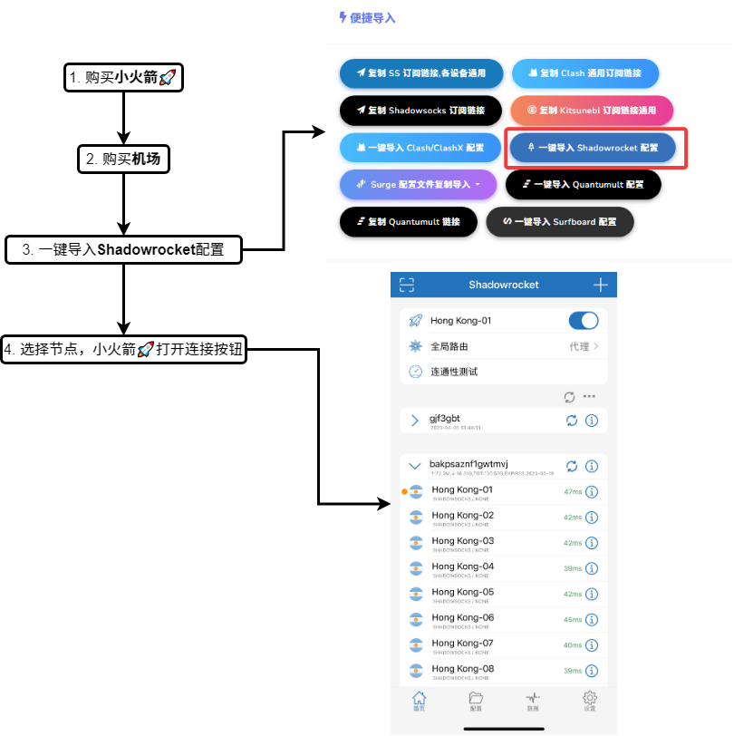
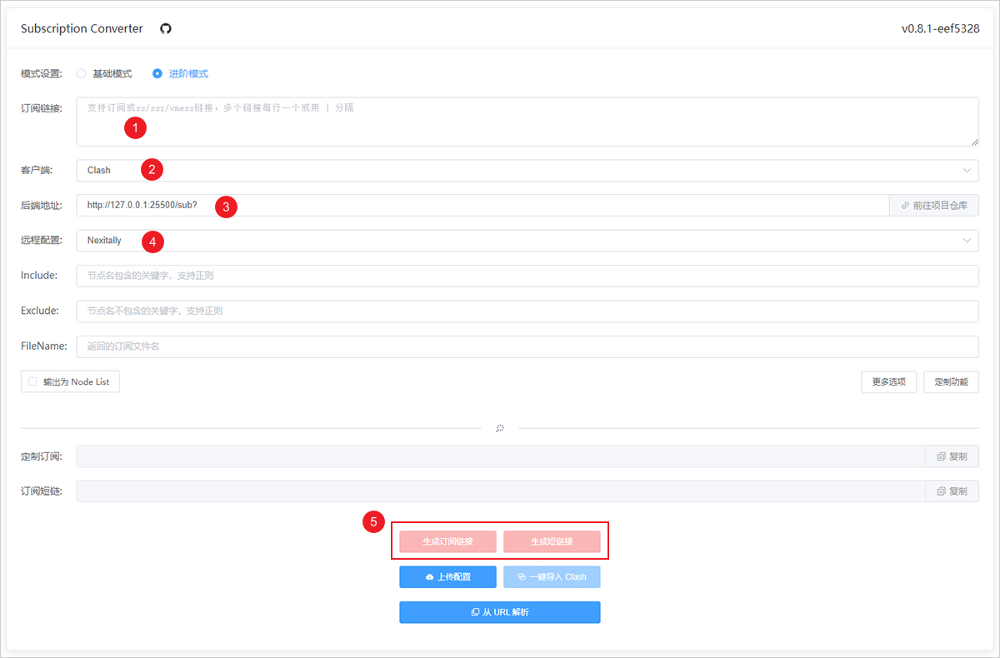
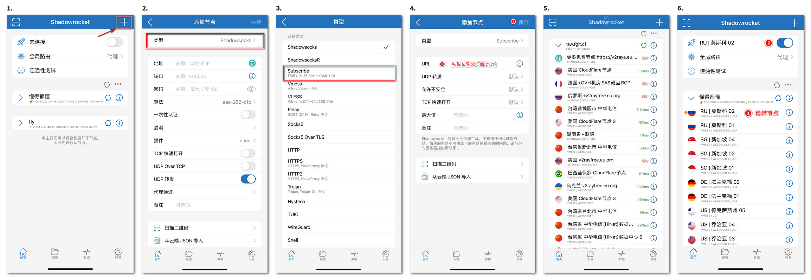
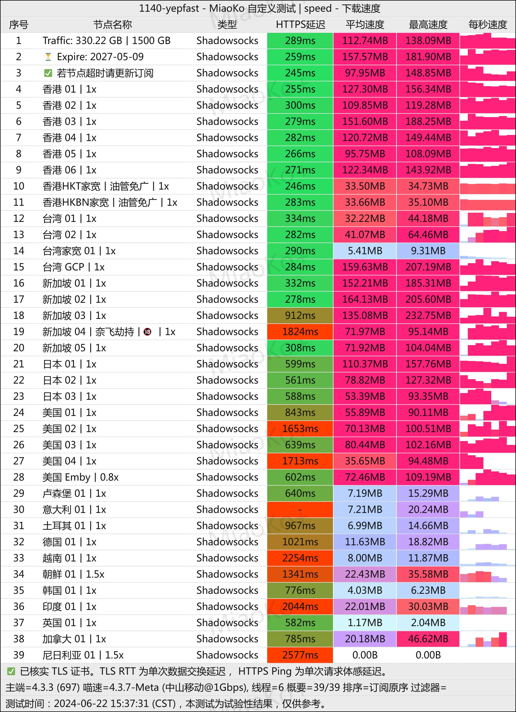
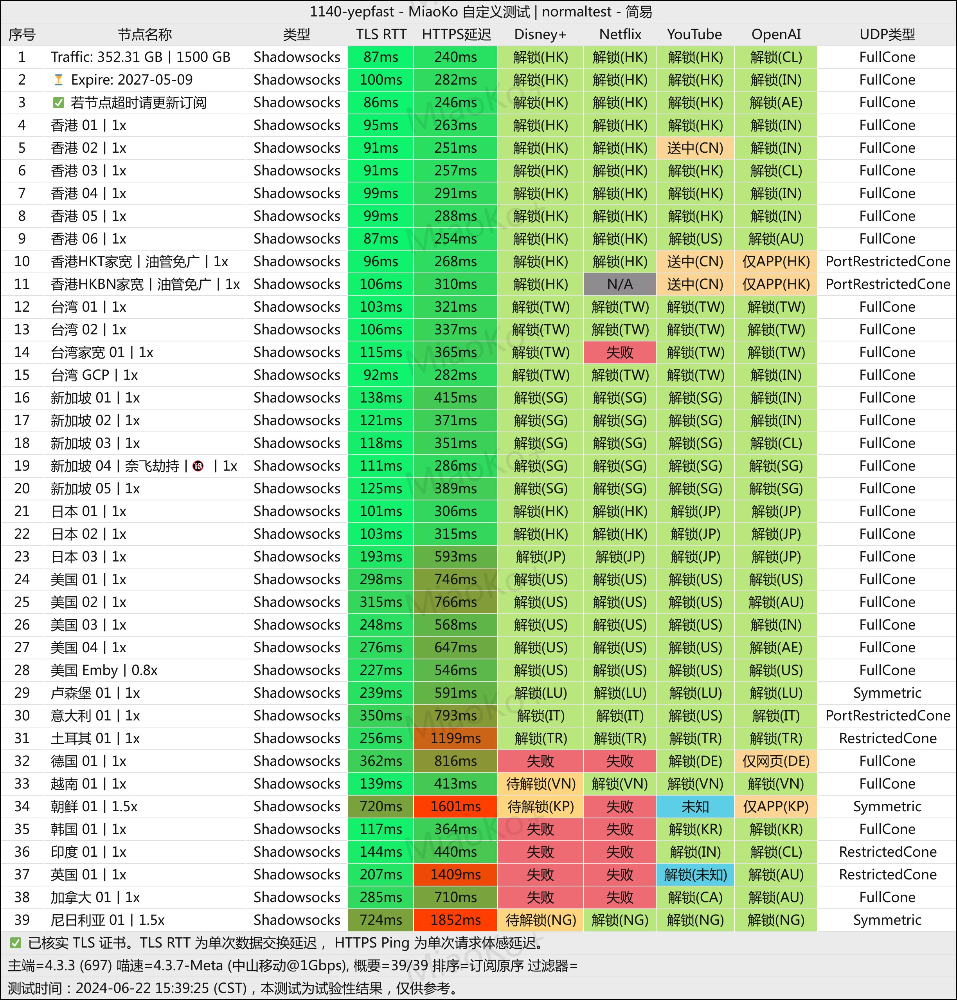
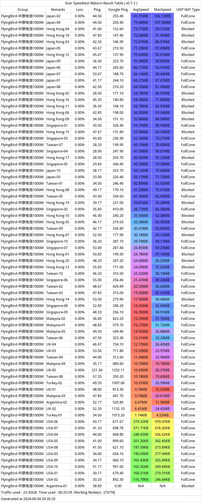
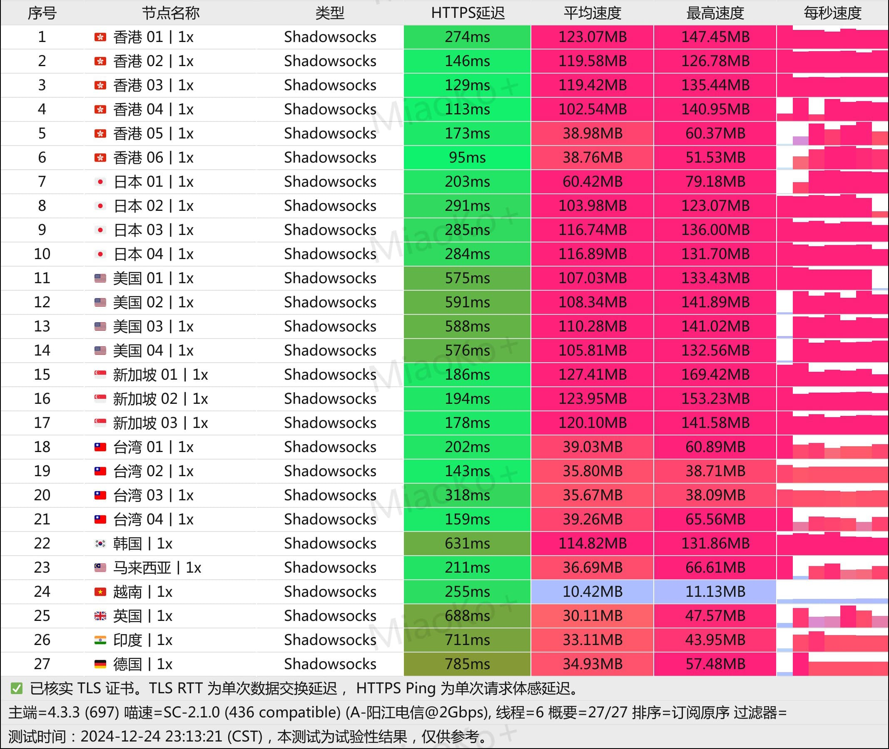
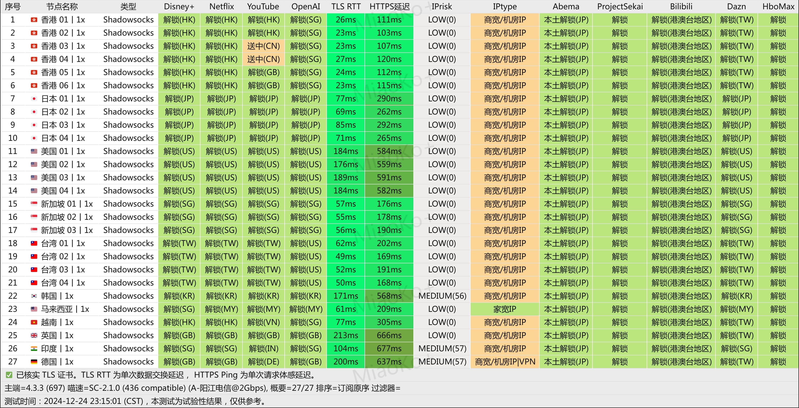
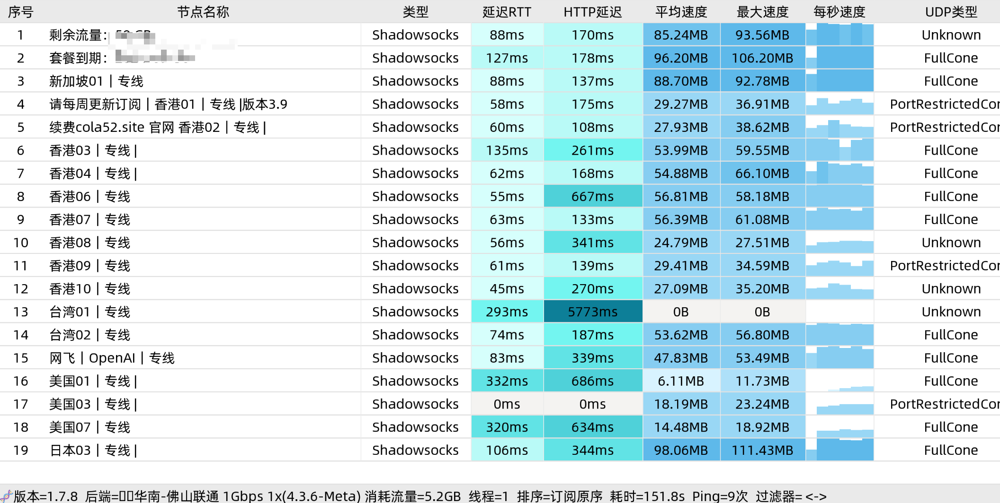
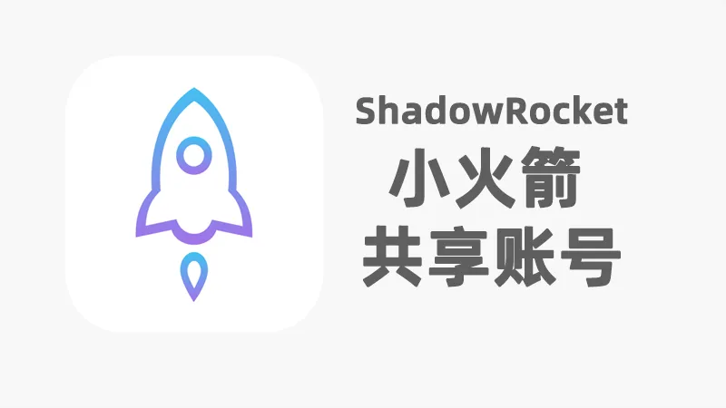

# 最新免费共享小火箭账号/已购shadowrocket共享Apple ID，小火箭账号购买，美区小火箭（2026年8月11日）

* [小火箭共享账号每日更新](https://ios.wwkejishe.top/)
* 美区 AppleID 成品独享账号：[小火箭 Shadowrocket 成品号 美国区](https://shop.wwkejishe.top/buy/6)（付费共享号近期不稳定已下架，**账号购买后可以修改密码、密保，并永久使用**）

## 目录导航

查看文章右侧导航

## 活动通知

1. TG群：[wwkjs888](https://t.me/wwkjs888)（进群置顶消息，一年免费订阅链接，4000G流量/每月）
2. [免费机场](free-shadowrocket.md#mian-fei-ji-chang) （白嫖 60GB/月）
3. [FlyingBird](free-shadowrocket.md#flyingbird-bo-zhu-zai-yong) ：春节促销活动开始，最低可达**8折**优惠

## 前言声明

> 此教程为了是让大家学习，切勿做违法犯罪的事哦！

TG群：[wwkjs888](https://t.me/wwkjs888)（进群不定期更新免费订阅节点，求稳还是请看[付费机场](free-shadowrocket.md#fu-fei-ji-chang)）

* [福利：免费领取京豆](https://www.wangdu.site/software/950.html)
* [Skinny 手机卡](https://fk.wwkejishe.top/buy/13)（[常见问题指南](https://www.wangdu.site/fuliyouhui/2019.html)）：0月租稳定使用的新西兰手机卡，可用来注册 **脸书、推特、Telegram、Gmail、Tiktok、ChatGPT**（价格优惠，先到先得）
* [2026年最高性价比电信移动联通流量卡推荐](https://www.wangdu.site/fuliyouhui/2112.html)
* [IPTV](https://www.wangdu.site/software/av-read/339.html): 2026年6月更新📺IPTV电视直播源、APTV电视直播源、IPTV直播软件、超全中国+台港澳+海外IPTV直播源M3U、TV观看工具，iptv最新可用直播源iptv4/iptv6

## 🔥推荐Ti子服务器

* Just My Socks 免搭建，直接使用富强服务👍
* [2026年国外高性价比便宜 VPS 推荐(稳定、好用、免费体验)](https://bestvps.wwkejishe.top/docs/tutorial-vps/choose-vps)：可自行 [Google搭建Ti子](https://home.wwkejishe.top/search/racknerd%E6%90%AD%E5%BB%BA%E6%A2%AF%E5%AD%90)
* [2026年VPS推荐 （自用、稳定、靠谱、便宜有性价比）](https://www.wangdu.site/bestvps)（[RackNerd](https://www.wangdu.site/fuliyouhui/1266.html)、[CloudCone](https://www.wangdu.site/fuliyouhui/2115.html)、[EthernetServers](https://www.wangdu.site/fuliyouhui/2116.html)、[DMIT](https://www.wangdu.site/?golink=aHR0cHM6Ly93d3cuZG1pdC5pby9hZmYucGhwP2FmZj03OTUy) 多家VPS价格动态对比表格）

Just My Socks 懒人版（只需2步，轻松富强上网，点我展开）

1. [点击购买 洛杉矶CN2 GIA（高性价比👍）](https://justmysocks3.net/members/aff.php?aff=31458\&pid=2\&language=chinese)（享受 5.2% 永久优惠优惠码：`JMS9272283`）
2. [Just My Socks](https://justmysocks3.net/members/aff.php?aff=31458\&language=chinese) 自家的专用客户端：[Jamjams](https://justmysocks3.net/members/knowledgebase.php?action=displayarticle\&id=5\&language=chinese)（支持系统：Windows、MacOS、iOS）

## ChatGPT

> ChatGPT 是由 OpenAI 开发的一个人工智能聊天机器人程序，于 2022 年 11 月推出。该程序使用基于 GPT-3.5 架构的大型语言模型并通过强化学习进行训练。 —— 维基百科

* [ChatGPT个人注册教程](https://www.wangdu.site/course/1302.html)
* [免费ChatGPT-4o服务👍](https://www.wangdu.site/course/2097.html)
* [LiLittleCat/awesome-free-chatgpt](https://github.com/LiLittleCat/awesome-free-chatgpt): 🆓免费的 ChatGPT 镜像网站列表，持续更新。
* [ChatGPT 账号 可能含5美金 未提取API-Key | 文武科技资源](https://fk.wangdu.site/buy/8)

## Shadowsocks软件介绍

### Shadowsocks 节点获取

机场请看下面的免费机场、[付费机场](free-shadowrocket.md#fu-fei-ji-chang)（机场里就是节点）

## 小火箭+机场教程（稳定）👍

机场请看下面的免费机场、付费机场（机场里就是节点）

<figure><figcaption></figcaption></figure>

#### 免费机场如何转为小火箭（shadowrocket）节点

出于安全考虑，能自己的搭建最好自己搭建。

1. Docker部署镜像：[subconverter](https://github.com/tindy2013/subconverter/releases)（服务端）、[sub-web](https://github.com/CareyWang/sub-web)（网页端）
2. 在线订阅转换链接
   * [https://sub-web.netlify.app/](https://sub-web.netlify.app/)（sub-web作者搭建的）

<figure><figcaption></figcaption></figure>

#### 小火箭添加订阅链接

<figure><figcaption></figcaption></figure>

## Android手机APP推荐👍

### Panda（APP）

免费用户只能固定线路，有两条推荐线路，看广告可以使用1小时

免费的看视频没问题，资金雄厚的可以300多购买2年的优惠

如果用着好用，请填写我的邀请码：**28712435**，让我为你的奖励发光发热

### 猴王（APP）

免费的，速度也挺快的，就一个底部的广告

### WhaleBlue（APP）

免费的有很多线路，选择最快的起飞?️就行

### 老王（APP）

免费的线路不少，可以智能连接，看一段广告就可以使用VIP加速了。

### 客户端+机场（稳定）

1. 在 客户端（也可在下面下载地址获取高速下载链接） 下载适配适配 Android手机的客户端（推荐：Clash、Surfboard、shadowsocks-android）
2. 在下面机场选择对应的节点导入即可

## Android手机APP下载地址

### APP下载

公众号：文武科技社

回复关键词：`网上学科`

## Windows、MacOS、Android、iOS代理客户端

| 客户端名称                                                                                                                                                                                                                                                                                 | 支持系统                                                                                                                                                                                                                                    | 最后更新时间 |
| ------------------------------------------------------------------------------------------------------------------------------------------------------------------------------------------------------------------------------------------------------------------------------------- | --------------------------------------------------------------------------------------------------------------------------------------------------------------------------------------------------------------------------------------- | ------ |
| [Pandora-Box](https://github.com/snakem982/Pandora-Box)                                                                                                                                                                                                                               | Windows、MacOS、Linux                                                                                                                                                                                                                     | 2025   |
| [mihomo-party](https://github.com/pompurin404/mihomo-party)                                                                                                                                                                                                                           | Windows、Mac、Linux                                                                                                                                                                                                                       | 2025   |
| [karing](https://github.com/KaringX/karing)：兼容 Clash、V2ray/V2fly、Sing-box、Shadowsocks、Sub、Github 订阅                                                                                                                                                                                   | [Win](https://github.com/KaringX/karing/releases/latest)、[Mac](https://apps.apple.com/us/app/karing/id6472431552)、[Android](https://github.com/KaringX/karing/releases/latest)、[iOS](https://apps.apple.com/us/app/karing/id6472431552) | 2025   |
| [sing-box](https://github.com/SagerNet/sing-box)                                                                                                                                                                                                                                      | [MacOS、iOS](https://sing-box.sagernet.org/zh/clients/apple/)（需要美区账号：[Apple Store注册外国Apple ID教程](https://www.wangdu.site/course/705.html)）、[Android](https://sing-box.sagernet.org/zh/clients/android/)                                  | 2024   |
| [Hiddify](https://github.com/hiddify/hiddify-next)（[官网地址](https://hiddify.com/)）：全面的协议支持：Vless、Vmess、Reality、TUIC、Wireguard、Hysteria、SSH；多种订阅链接和配置文件格式支持： Sing-box、V2ray、Clash、Clash meta                                                                                             | Win、Mac、Linux、安卓、iOS                                                                                                                                                                                                                    | 2024   |
|                                                                                                                                                                                                                                                                                       | Clash系列                                                                                                                                                                                                                                 |        |
| [clash-verge新版👍🏻](https://github.com/clash-verge-rev/clash-verge-rev)（[新版下载地址](https://clash-verge-rev.github.io/install.html)）                                                                                                                                                     | Win、Mac、Linux                                                                                                                                                                                                                           | 2024   |
| [clash-nyanpasu](https://github.com/LibNyanpasu/clash-nyanpasu)                                                                                                                                                                                                                       | Win、Mac、Linux                                                                                                                                                                                                                           | 2024   |
| [GUI.for.Clash](https://github.com/GUI-for-Cores/GUI.for.Clash)                                                                                                                                                                                                                       | Win、Linux                                                                                                                                                                                                                               | 2024   |
| [FlClash](https://github.com/chen08209/FlClash/tree/main)                                                                                                                                                                                                                             | Win、Mac、Linux、Android                                                                                                                                                                                                                   | 2024   |
| [mihomo-party](https://github.com/pompurin404/mihomo-party?tab=readme-ov-file)                                                                                                                                                                                                        | Win、Mac、Linux                                                                                                                                                                                                                           | 2024   |
| [ClashX Pro👍🏻](https://install.appcenter.ms/users/clashx/apps/clashx-pro/distribution_groups/public)                                                                                                                                                                                | Mac                                                                                                                                                                                                                                     | 2023   |
| [Clash](https://github.com/Fndroid/clash_for_windows_pkg)(已删库：20231103)、[Clash汉化包](https://github.com/BoyceLig/Clash_Chinese_Patch/releases)、[备份版本：0.20.39](https://app.nloli.xyz/static/Clash.for.Windows.Setup.0.20.39.exe)、[备份](https://archive.org/details/clash_for_windows_pkg) | Win                                                                                                                                                                                                                                     | 2022   |
| [clash-verge](https://github.com/zzzgydi/clash-verge)（clash暂时替代品【老版已停更】）、                                                                                                                                                                                                             | Win、Mac、Linux                                                                                                                                                                                                                           | 2023   |
| [clashN](https://github.com/2dust/clashN)                                                                                                                                                                                                                                             | Win                                                                                                                                                                                                                                     | 2023   |
| [Fclash](https://github.com/Fclash/Fclash)（20231102只读，没有Release安装包）                                                                                                                                                                                                                   | Windows、MacOS、Android                                                                                                                                                                                                                   | 2023   |
| [Clash Nyanpasu](https://github.com/keiko233/clash-nyanpasu)                                                                                                                                                                                                                          | Win、Mac、Linux                                                                                                                                                                                                                           | 2023   |
| [clash-for-flutter](https://github.com/mapleafgo/clash-for-flutter)                                                                                                                                                                                                                   | Win、Mac、Linux                                                                                                                                                                                                                           | 2023   |
| [Clashy](https://github.com/SpongeNobody/Clashy)                                                                                                                                                                                                                                      | Win、Mac、Ubuntu                                                                                                                                                                                                                          | 2022   |
| [ClashPro](https://github.com/ClashForIOS/ClashPro)                                                                                                                                                                                                                                   | Win、Mac、iOS                                                                                                                                                                                                                             | 2023   |
| [clashX](https://github.com/yichengchen/clashX)                                                                                                                                                                                                                                       | Mac                                                                                                                                                                                                                                     | 2022   |
| [ClashDotNetFramework](https://github.com/ClashDotNetFramework/experimental-clash)                                                                                                                                                                                                    | Win、Linux                                                                                                                                                                                                                               | 2021   |
|                                                                                                                                                                                                                                                                                       | V2Ray系列                                                                                                                                                                                                                                 |        |
| [V2RayW](https://github.com/Cenmrev/V2RayW)                                                                                                                                                                                                                                           | Win                                                                                                                                                                                                                                     | 2019   |
| [V2RayN](https://github.com/2dust/v2rayN)                                                                                                                                                                                                                                             | Win                                                                                                                                                                                                                                     | 2022   |
| [v2rayNG](https://github.com/2dust/v2rayNG)                                                                                                                                                                                                                                           | Android                                                                                                                                                                                                                                 | 2022   |
| [V2Ray-Desktop](https://github.com/Dr-Incognito/V2Ray-Desktop)                                                                                                                                                                                                                        | Mac、Win、Linux                                                                                                                                                                                                                           | 2022   |
| [V2rayU](https://github.com/yanue/V2rayU)                                                                                                                                                                                                                                             | Mac                                                                                                                                                                                                                                     | 2021   |
|                                                                                                                                                                                                                                                                                       | SS系列（shadowsocks）                                                                                                                                                                                                                       |        |
| [shadowsocks-windows](https://github.com/shadowsocks/shadowsocks-windows/releases)                                                                                                                                                                                                    | Win                                                                                                                                                                                                                                     | 2022   |
| [shadowsocks-android](https://github.com/shadowsocks/shadowsocks-android)                                                                                                                                                                                                             | Android                                                                                                                                                                                                                                 | 2023   |
| [ShadowsocksX-NG](https://github.com/shadowsocks/ShadowsocksX-NG/releases)                                                                                                                                                                                                            | Mac                                                                                                                                                                                                                                     | 2019   |
| [shadowsocksr(SSR)](https://github.com/shadowsocksrr/shadowsocksr-csharp/releases)                                                                                                                                                                                                    | Win                                                                                                                                                                                                                                     | 2019   |
|                                                                                                                                                                                                                                                                                       | 其他                                                                                                                                                                                                                                      |        |
| [Shadowrocket（小火箭）在线安装](https://shadowsockshelp.github.io/ios/)、[App Store](https://apps.apple.com/us/app/shadowrocket/id932747118)：收费，不在国区👍                                                                                                                                         | iOS                                                                                                                                                                                                                                     | 2022   |
| [Quantumult X on the App Store](https://apps.apple.com/us/app/quantumult-x/id1443988620?platform=iphone)：收费，不在国区                                                                                                                                                                      | iOS                                                                                                                                                                                                                                     | 2022   |
| [Loon on the App Store](https://apps.apple.com/us/app/loon/id1373567447?platform=iphone)：收费，不在国区                                                                                                                                                                                      | iOS                                                                                                                                                                                                                                     | 2022   |
| [Stash on the App Store](https://apps.apple.com/us/app/stash-rule-based-proxy/id1596063349?platform=iphone)：收费，不在国区                                                                                                                                                                   | iOS                                                                                                                                                                                                                                     | 2022   |
| [OneClick](https://github.com/oneclickearth/oneclick)                                                                                                                                                                                                                                 | 安卓、iOS                                                                                                                                                                                                                                  | 2022   |
| [Clash👍🏻](https://apkpure.com/cn/clash-for-android/com.github.kr328.clash/versions)                                                                                                                                                                                                 | 安卓                                                                                                                                                                                                                                      | 2022   |
| [Wrap+](https://1.1.1.1/)：Cloudflare 公司开发的，[教程：Warp+ 24PB 无限流量密钥](https://www.ahhhhfs.com/40632/)                                                                                                                                                                                     | Win、Mac、Linux、安卓、iOS                                                                                                                                                                                                                    | 2023   |
| [Surfboard](https://manual.getsurfboard.com/)                                                                                                                                                                                                                                         | 安卓                                                                                                                                                                                                                                      | 2023   |
| [Surge](https://nssurge.com/)：收费，不在国内                                                                                                                                                                                                                                                 | Mac、iOS                                                                                                                                                                                                                                 | 2023   |

## 其他教程

* [使用不限流量的cloudflare VPN并且自选IP](https://duangks.com/archives/124/)：需要富强
* [WARP-Clash-API👍](https://github.com/vvbbnn00/WARP-Clash-API)：该项目可以让你通过订阅的方式使用 Cloudflare WARP+，自动获取流量（[在线服务](https://tofree.zeabur.app/)：支持Clash、Surge、Shadowrocket）
* [使用Github Action搭建全自动永久免费获取机场节点/订阅](https://linux.do/t/topic/96234)

## 机场测速

[DuyaoSS](https://www.duyaoss.com/)

## 免费机场（不保证都可用/多切换试试）

可以使用 [在线订阅转换链接](free-shadowrocket.md#mian-fei-ji-chang-ru-he-zhuan-wei-xiao-huo-jian-shadowrocket-jie-dian) 转为符合自己客户端的链接

### 免费机场

* [宝可梦](https://web3.52pokemon.cc/register?code=OD5C6b6T)：白嫖 60GB/月，入门套餐 ￥5.9，8月白嫖码：`飞天螳螂`

### 免费clash订阅链接

其他客户端可通过在线订阅转换链接自行转换，喜欢折腾的可以通过 教程 自行搭建

* clash 订阅链接：`https://qyoo.aibvs.cn/api/v1/client/subscribe?token=d1238234772e17cc53229bcbb74980ed`
* Clash 订阅地址：`http://777.hz.cz/Clash-11041936.yaml`

### 免费SS账号

[https://free-ss.site](https://free-ss.site/)

### SS/SSR 免费节点订阅地址

* [https://raw.githubusercontent.com/ssrsub/ssr/master/ssrsub](https://raw.githubusercontent.com/ssrsub/ssr/master/ssrsub)
* [https://www.liesauer.net/yogurt/subscribe](https://www.liesauer.net/yogurt/subscribe?ACCESS_TOKEN=DAYxR3mMaZAsaqUb)
* [免费ssr节点分享](https://freefq.com/free-ssr/)：所有账号、节点或服务器均源自国际互联网

### 免费节点GitHub库

PS：**下面仓库中付费的内容，请谨慎购买，只推荐使用免费**，下面付费机场为博主在用的，求稳定的还是使用付费的吧。

* 小火箭 / V2RAY 订阅地址：`https://www.xrayvip.com/free.txt`
* Clash 订阅地址：`https://www.xrayvip.com/free.yaml`
* [getNode](https://github.com/Flik6/getNode)：每小时更新最新的 Clash、v2ray 节点信息
* [v2cross](https://v2cross.com/archives/1884)：SS 节点（富强获取）
* [Free-servers](https://github.com/Pawdroid/Free-servers): 6小时更新一次，免费ss/v2ray/trojan节点
* [v2rayfree](https://github.com/aiboboxx/v2rayfree): v2ray节点

### TG群

* [长风分享频道](https://t.me/changfengchannel)：每4小时更新一次，最多一次显示50条

### 网站

* [长风分享](https://www.cfmem.com/search/label/free)：每天更新 Clash、v2ray 节点信息

## 付费机场

PS：**最好月付，防止跑路！**

### YepFast（博主在用👍🏻）

[YepFast](https://portal.yepfast2.cc/#/register?code=G8n2THKO) 有自家的 `Windows、macOS、Android` 客户端，更加方便快捷，iOS 用户还是得需要 [下载小火箭](free-shadowrocket.md#shadowrocket-zhang-hao) 使用

* 备用网址：[YepFast](https://yep.top/#register?code=G8n2THKO)
* 备用网址：[YepFast](https://yep.top/#register?code=G8n2THKO)


飞鸟春节活动开启！！！

1. 月/季/半年付 85折 , 优惠码：`fbcj2685` （可重复使用5次）
2. 年付8折（站内折上折，高达64折 ）优惠码：`fbcj2680`（可重复使用5次）

活动时间：即日至2026年3月08日23点59分


套餐：

* 10元/月（年付￥99）
* 150G 流量/月
* 20+ 椰汁畅享中继线路
* 解锁 Netflix、Disney+、ChatGPT
* 不限设备数量，不保证带宽速度
* 每月购买日免费重置流量

YepFast测速图&#x26;解锁图

YepFast测速图

YepFast解锁图

### FlyingBird（博主在用）

[FlyingBird](https://fbinv01.fbaff.cc/auth/register?code=jvQ5)

* 备用网址: [FlyingBird](https://www.fbweb.cc/auth/register?code=jvQ5)
* 备用网址: [FlyingBird](https://fbweb02.flyingbird.la/auth/register?code=jvQ5)
* 备用网址: [FlyingBird](https://fbweb02.flyingbird.id/auth/register?code=jvQ5)
* 备用网址: [FlyingBird](https://web02.fbcn.pro/auth/register?code=jvQ5)


飞鸟双十一活动开启！！！上活动！！！

1. 月/季/半年付 85折 , 优惠码：`fb25111185`（可重复使用5次）
2. 年付8折（站内折上折，高达64折 ）优惠码：`fb25111180` （可重复使用5次）

活动时间：即日至 2025年11月30日23点59分


套餐：

* 100GB / 15元 / 30 天
* 不限制客户端数量
* 不限制速度
* 支持所有节点线路
* 流媒体解锁
* 全节点支持ChatGPT等AI工具
* 支持大陆及海外全球用户使用

FlyingBird测速图

FlyingBird测速图

### 鹿语云（IEPL专线机场，博主在用）

[鹿语云](https://xn--9kqu90mqwl.com/register?code=CZoLVxMH)：（稳定极速，20+节点，全节点IEPL专线，全节点流媒体解锁，全节点支持ChatGPT等AI工具，海外团队，安全可靠）

* 备用地址：[鹿语云](https://luyuyun.com/register?code=CZoLVxMH)

**活动内容如下：**

* 月/季/半年付85折，优惠码：`luyu85`
* 年付8折，优惠码：`luyu8`

**活动有效期：**

即日起至 2025/10/15 23:59

套餐

* 50GB / 16元 / 1月（年付：119元）
* 150GB / 26元 / 1月（年付：259元）
* 全节点IEPL专线，低延迟，支持游戏加速
* 全节点流媒体解锁
* 全节点支持ChatGPT等AI工具

鹿语云测速图&#x26;解锁图

鹿语云测速图

鹿语云解锁图

### 可乐云（博主在用）

[可乐云机场](https://su.colac.fun/?path=register\&code=LaT1fen2)，成立于2020年，是一款快速、稳定的网络加速器。本产品特点支持主流电脑端一键app加速，可免去第三方客户端的复杂配置问题。游戏、软件全时段享用、流媒体当地全解锁，畅游网络世界。

* 备用地址：[鹿语云](https://luyuyun.com/register?code=CZoLVxMH)

套餐

* 100G / 15.9元 / 1月（年付：118元）
* 300G / 19.9元 / 1月（年付：168元）
* 地区：香港、台湾、日本、美国
* 不限连接数

可乐云测速图

可乐云测速图

### 一元机场

[一元机场](https://xn--4gq62f52gdss.ink/#/register?code=HUliZ7Oi)：适用追求价格便宜，对上外网需求不大，稳定性不高；求稳请看上面几款付费机场

套餐

* 年付12元，1元/月 | 两年付20元，0.8元/月
* 月流量：50G
* 地区：香港日本新加坡美国
* 解锁 Netflix, Disney+
* 不限速，不限连接数
* 请知悉无退款服务

## Shadowrocket小火箭账号

更新时间：2025年9月9日

[小火箭共享Shadowrocket账号每日更新](https://ios.wwkejishe.top/)（博主自维护）

注意：**切勿在设置登陆iCloud账号！！不要点升级！不要点升级！不要点升级！**

1. 美区AppleID成品账号（已增加库存，数量有限，先到先得）：[小火箭 Shadowrocket 成品号 美国区](https://fk.wangdu.site/buy/6)（**账号购买后可以修改密码、密保，并永久使用**）
2. 共享账号容易失效，需要稳定的可购买成品账号
3. 美区AppleID共享小火箭：[小火箭id共享账号，租用已购此App账号](https://fk.wangdu.site/buy/7)下载，租用与独享账号下载的 App 没有区别，下载的 App 只要不删除永久可用，`只是后续不能升级`。

### 共享苹果ID站点

<figure><figcaption>
2025最新iOS免费小火箭ShadowRocket共享账号
</figcaption></figure>

此为第三方站长，只做分享，不保证质量安全，不解决使用中出现的问题

* [免费共享shadowrocket小火箭账号](https://ao.ke/)：有带shadowrocket、stash、Quantumult X、不带收费App的美区账号、台湾区、日本区、韩国区、香港区账号
* [最新小火箭账号/已购shadowrocket id共享Apple ID](https://shenhouyun.com/ios/)
* [宝盒](https://ccbaohe.com/appleID/)
* [AneeoApple](https://ios.aneeo.com/books/verification)：里面有美国、国区账号，密码需要关注Telegram群/公众号来获取
* [免费小火箭下载，共享小火箭账号，共享shadowrocket账号，已购shadowrocket免费Apple ID - TK宝盒](https://tkbaohe.com/Shadowrocket/)

### 使用教程

## 客户端使用教程

### Windows-v2rayN使用教程

Windows-v2rayN使用教程

1.  在 付费机场 已经购买好套餐，下载v2rayN客户端 [点击下载](https://dl.flyingbird.vip/apps/v2rayn_win.zip) 下载后解压并运行 v2rayN.exe

    
2.  登陆机场官网`复制SS通用订阅地址 / 导入Shadowrocket`

    
3.  点击v2rayN订阅 --> 订阅设置 --> 添加订阅并确定

    

    

    
4.  更新订阅 --> 得到服务器节点

    

    
5.  选择节点并回车选中

    
6.  在电脑右下角任务栏开启你的代理并尽情享用高速网络

    

### Windows-Clash使用教程

Windows-Clash使用教程

1.  在 付费机场 已经购买好套餐，下载Clash客户端 [点击下载](https://dl.flyingbird.vip/apps/clash_win.zip) 并解压运行 Clash for Windows.exe

    
2.  打开机场官网，点击`一键导入Clash配置`

    

    
3.  导入后选 Proxies，并选择 Rule 模式和节点

    
4.  选 General 并启用系统代理，尽情享受高速上网

    

### Shadowsocks软件介绍及使用教程

Shadowsocks软件介绍

**SS**，全称为 **Shadowsocks**（下文简称为`SS`），是一种基于 Socks5 代理方式的网络数据加密传输包的工具，可以使用其于**科学上网** _也就是翻墙_ ，是目前最稳定，最常用的科学上网工具之一，**全平台支持**

**SSR**，全称为 **ShadowsocksR**（下文简称为`SSR`）。ShadowsocksR 是breakwa11发起的Shadowsocks分支，在Shadowsocks的基础上增加了一些数据混淆方式，称修复了部分安全问题并可以提高QoS优先级。后来贡献者Librehat也为Shadowsocks补上了一些此类特性，甚至增加了类似Tor的可插拔传输层功能。

Shadowsocks使用教程

以SS为例，SSR差不多

1. （**具体信息**的订阅地址）右击**小飞机**，打开**服务器 - 编辑服务器**，输入服务器信息即可。
2. （**图片二维码**的订阅地址）右击**小飞机**，打开**服务器 - 扫描屏幕上的二维码**，服务器信息自动导入。
3. （**长链接**的订阅地址）右击**小飞机**，打开**服务器 - 从剪切板导入URL**，服务器信息自动导入。

**Shadowsocks 节点获取**

机场请看下面的免费机场、付费机场（机场里就是节点）

### MacOS-ClashX Pro使用教程

MacOS-ClashX Pro使用教程

1. 在 付费机场 已经购买好套餐，下载MAC版本ClashX Pro [点击下载](https://dl.flyingbird.vip/apps/clashx_mac.dmg) ，安装并启动
2.  打开机场官网，点击`一键导入ClashX配置`

    
3.  点击`一键导入Clash/ClashX配置`后会跳出上面对话框，然后点OK

    
4.  软件会自动加载订阅，当你看到上面的日期后就是导入成功，然后关掉就可以了。

    
5.  在你电脑的最顶上状态栏里会出现 ClashX Pro 的图标，如果没看到这处图标就是你开太多东西了，关掉一些应用程序，直到你看到这个图标。

    
6.  选择 Rule 模式

    
7.  选择节点

    
8.  启动系统代理！到这一步你就可以正常浏览器代理上网了。如果你想让整台电脑所有的应用都开启代理，可以把下面的Enhanced Mode也打勾就可以了。

    

### Android安卓-Clash使用教程

Android安卓-Clash使用教程

1.  在 付费机场 已经购买好套餐，下载安卓Android-Clash [点击下载](https://dl.flyingbird.vip/apps/clash_android.apk) ，安装并启动

    
2.  打开机场官网，点击`一键导入Clash配置`

    

    
3.  选择配置并激活机场配置

    

    
4.  运行代理并选择节点，享受高速上网

    

    

#### iOS苹果-Shadowrocket使用教程

iOS苹果-Shadowrocket使用教程

### CloudFlare WARP客户端使用教程

> 推荐使用上面客户端+机场的组合

Cloudflare WARP 是一种由Cloudflare推出的网络加速和安全服务，旨在通过将用户的网络流量路由到Cloudflare的全球骨干网络中来实现加速和优化用户的网络体验。它使用了现代的加密协议（如WireGuard），以确保用户数据的安全性和隐私性。

CloudFlare WARP客户端使用教程

1.  Windows版优选和更换IP，解压文件后（看下图解）

    

    * 下载[Warp优选IP和更换IP.rar](https://img.ccbaohe.com/warp%E4%BC%98%E9%80%89IP%E5%92%8C%E6%9B%B4%E6%8D%A2IP.rar) / [CloudflareSpeedTest](https://github.com/XIU2/CloudflareSpeedTest)（「自选优选 IP」测试 Cloudflare CDN 延迟和速度，获取最快 IP ！当然也支持其他 CDN / 网站 IP \~） 并解压，点击优选ip，优选完毕后会自动生成 result.csv 文件。
    * 打开 result.csv 文件，任意复制一条IP。
    * 打开更换IP，输入复制的IP。回车既可更换可以用IP
2.  下载并安装客户端：打开官方地址： [https://1.1.1.1/zh-Hans/](https://1.1.1.1/zh-Hans/) ，选择适合自己平台的客户端下载

    
3.  Warp+24PB 无限流量密钥

    * 使用Telegram电报搜索：[@generatewarpplusbot](https://t.me/generatewarpplusbot)，找到这个机器人，点击开始，然后点击`/generate`。它要求我们订阅三个群组，这个直接订阅就行。
    * 再次点击`/generate`，就会给我们生成密钥。

    
4.  客户端安装并启动客户端并连接节点

    启动CloudFlare WARP时候，有可能遇到无法注册的问题：由于注册服务域名被GFW阻断。

    第一次打开客户端之前，需要打开代理软件的真全局模式（例如：Clash的TUN模式），如在手机上则打开任意代理软件即可 进入设置选项，Device ID出现非0000的字符串时，即为注册成功

    

    

    断开并关闭代理软件，连接 WARP。如出现 Connected 即为连接成功

    

    如一直处在 Connecting 状态，则说明目前 WARP 服务已被 GFW 阻断；更换 WARP+ 密钥

    

    

    切换为Teams账户：打开客户端之前，需要打开代理软件的真全局模式（例如：Clash的TUN模式)，如在手机上则打开任意代理软件即可 打开WARP客户端 按照下图操作

    

    

## 作者网站

* [文武科技柜](https://www.wangdu.site/)：实用工具、黑苹果、高效教程、Nas
* [文武软件百科](https://wiki.wangdu.site/)：致力于软件的百科全书
* [文武帮助中心](https://help.wwkejishe.top/)：包含小火箭共享账号及使用教程、IPTV直播源、Skinny电话卡

## Star History

