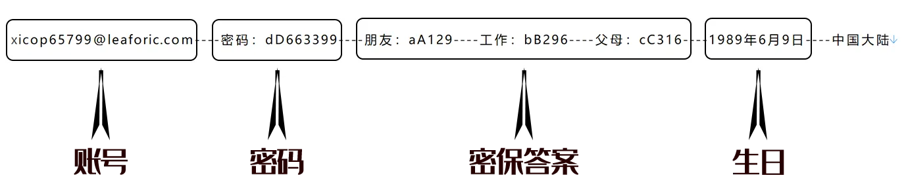

# Shadowrocket小火箭共享号登录AppStore下载App教程

## 购买地址

[【租借】Shadowrocket小火箭共享下载号,小火箭租用号（自动发货） | 文武科技资源](https://fk.wwkjs.top/buy/7)

## 注意


由于系统的迭代更新和时间差异，教程和实际可能会有些出入，但是大同小异，请根据实际界面进行操作！

请注意，如果您是更新软件！

请注意，如果您是更新软件！

请注意，如果您是更新软件！

那使用的是帐号原来的ID，请卸载以后重新安装，注意软件数据保存！


## **登录操作流程动态图解**

&#x20;

## &#x20;**登录操作流程平面图解**

### **第一步：读懂卡密**

<figure><figcaption></figcaption></figure>

在您自己的卡密&#x4E2D;**（请不要使用图中的卡密信息，那只是案例！）**，读出密码+密码，登陆商店仅需要这两个，密保问题在修改密码时候使用。

### **第二步：登陆商店**

<figure><figcaption></figcaption></figure>

顺利的话，您就能正常使用拉！**登陆完成以后，最好重启一下应用商店以便刷新缓存**

## 常见问题

1. **更新出错？请先卸载软件再下载，注意保存数据**
